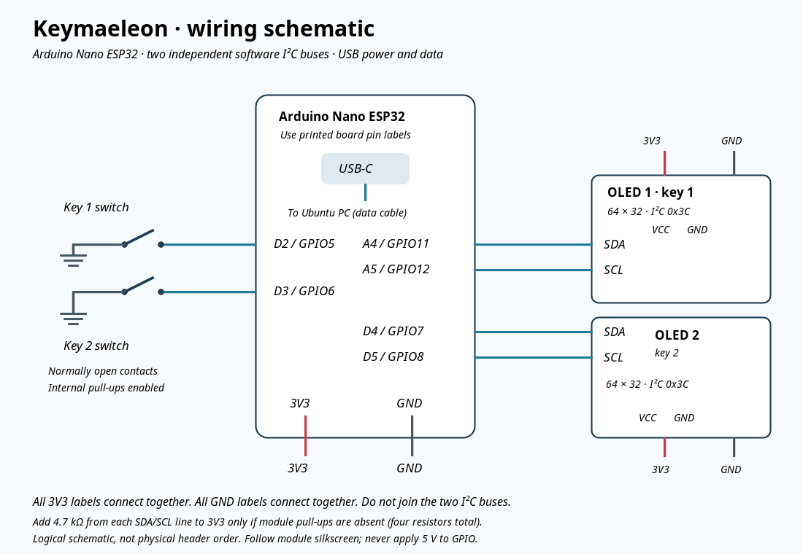

# Keymaeleon detailed reference

For the short Ubuntu X11 setup, start with [the README](../README.md).

Two mechanical keys, each with a 64 × 32 OLED, powered by an **Arduino Nano ESP32**. The Ubuntu companion follows the **focused application** and changes both labels and actions. USB carries power, serial messages, and standard keyboard/volume HID reports. No Wi-Fi or cloud service is needed.

| Focused app | Left key | Right key |
|---|---|---|
| Firefox | Back — Alt+Left | Refresh — Ctrl+R |
| VS Code | Save — Ctrl+S | Run without debugging — Ctrl+F5 |
| GNOME Terminal / GNOME Console | Clear visible terminal — Ctrl+L | New tab — Ctrl+Shift+T |
| Spotify desktop app | Play/pause | Next track |
| Desktop | Volume down | Volume up |
| Other app / unavailable focus | Disabled | Disabled |

“Run” uses VS Code's configured run/debug target; you may need a language extension and `.vscode/launch.json`. It is not the Code Runner extension command. Terminal clear redraws the screen; it does not erase history or necessarily scrollback. Terminal shortcuts assume the shell prompt is active; a full-screen terminal program can interpret them differently. Each press triggers once; holding does not repeat. Spotify is targeted through `playerctl --player=spotify`, so another media player does not accidentally receive its commands.

## Files

- [`firmware/Keymaeleon/Keymaeleon.ino`](../firmware/Keymaeleon/Keymaeleon.ino): Arduino firmware.
- [`companion/keymaeleon.py`](../companion/keymaeleon.py): Ubuntu companion.
- [`gnome-extension/keymaeleon@local`](../gnome-extension/keymaeleon@local): GNOME focus provider for Wayland or X11.
- [`docs/wiring.svg`](../docs/wiring.svg): scalable wiring schematic.
- [`tests/test_companion.py`](../tests/test_companion.py): automated companion tests.

## Wiring



[Open the scalable SVG schematic](../docs/wiring.svg).

This design assumes **four-pin, SSD1306, 64 × 32 I²C OLED modules that operate from 3.3 V**, typically address `0x3C`. The exact HiLetgo product revision/controller was not independently confirmed: check its listing or datasheet and the labels on your modules before soldering. A raw OLED panel or SPI module needs different wiring. Connector order varies: connect by **GND/VCC/SCL/SDA labels**, not by position in a product photo.

Disconnect USB while wiring. Use the Nano's **3V3**, not VBUS/VUSB or VIN, for both displays. Its GPIO uses 3.3 V logic. All grounds join. The GPIO numbers below are references; the sketch uses Arduino board-label constants.

| Nano printed pin | ESP32 GPIO | Connect to |
|---|---:|---|
| 3V3 | — | OLED 1 VCC and OLED 2 VCC |
| GND | — | Both OLED GND pins and one contact of each switch |
| A4 | 11 | OLED 1 SDA |
| A5 | 12 | OLED 1 SCL (sometimes marked SCK) |
| D4 | 7 | OLED 2 SDA |
| D5 | 8 | OLED 2 SCL |
| D2 | 5 | Other contact of switch 1 |
| D3 | 6 | Other contact of switch 2 |
| USB-C | — | Ubuntu PC through a USB data cable |

Both OLEDs can retain `0x3C` because the firmware uses **two independent software I²C buses**. No address modification or multiplexer is required. Do not tie the two SDA lines or the two SCL lines together. Switches use `INPUT_PULLUP`; pressing connects the input to ground. No matrix or switch diodes are necessary for two independently wired switches. Use the switch's two electrical contacts, not LED or plastic mounting pins.

Most OLED breakouts already have I²C pull-ups. If yours do not, add one **4.7 kΩ resistor from each of the four SDA/SCL lines to 3V3**. Never pull those lines to 5 V. Optional 100 nF ceramic capacitors across VCC/GND near each OLED help with wiring noise. Keep wires short; use flexible wire with strain relief and enough slack for moving keycaps. Verify the display board cannot short against switch metalwork.

## Flash the Nano

1. In Arduino IDE, install **Arduino ESP32 Boards by Arduino** in Boards Manager. Select **Arduino Nano ESP32** (not classic Nano, Nano 33, or a generic ESP32 board).
2. Install **U8g2 by oliver** through Library Manager. USB keyboard and consumer-control libraries come with the board package.
3. Open `firmware/Keymaeleon/Keymaeleon.ino`.
4. Set **Tools → USB Mode → Normal mode (TinyUSB)**. Use **Pin Numbering → By Arduino pin (default)**. Where separately available, enable **USB CDC On Boot**. Normal mode is required for serial + HID together; hardware CDC/debug mode is not suitable.
5. Select the Nano's port and upload. Close Serial Monitor before starting the companion. If uploading fails, stop the companion and double-tap reset to enter the bootloader, then reselect the port.
6. Both displays should show **a crossed-out plug icon** until the companion connects. Switches do nothing offline.

The default driver is `U8G2_SSD1306_64X32_1F_F_SW_I2C`, which selects the 32-row scan setting. This replaces the `NONAME` variant to address reported noise below readable text; the fix still needs confirmation on the physical displays. If output remains corrupted, confirm the module's controller and geometry. U8g2's `setI2CAddress()` takes a shifted address (`0x3C << 1`). For a module strapped to `0x3D`, change that display's address. A successful sketch upload does not prove the OLED has acknowledged or has the expected controller.

## Ubuntu setup

Run these commands from the repository directory as your normal desktop user:

```bash
sudo apt update
sudo apt install python3-venv python3-pip libglib2.0-bin playerctl x11-utils
python3 -m venv .venv
.venv/bin/pip install -r companion/requirements.txt
sudo usermod -aG dialout "$USER"
```

Log out and back in after adding `dialout`. Do not run the companion with `sudo`; it needs your desktop session bus. Check `echo "$XDG_SESSION_TYPE"` and `gnome-shell --version` to identify the session.

### Optional GNOME provider (Wayland)

Ordinary Wayland clients cannot query every application's focused window. The included local GNOME Shell extension supplies that identity over your session D-Bus. It exposes application ID/class and window identity, not document titles or contents. It does not inject keys; the Nano acts as a USB keyboard.

The extension is written for **GNOME Shell 45–50** (modern ES-module extensions). These are declared compatibility targets, not six separately tested desktops. GNOME 42/Ubuntu 22.04 users can use the X11 backend below; other Wayland compositors need their own focus provider.

```bash
mkdir -p ~/.local/share/gnome-shell/extensions/keymaeleon@local
cp gnome-extension/keymaeleon@local/extension.js gnome-extension/keymaeleon@local/metadata.json \
  ~/.local/share/gnome-shell/extensions/keymaeleon@local/
```

When using this optional provider, include `--backend gnome` in all companion launch commands (including autostart). X11 remains the default.

Log out and back in to make GNOME discover the extension, then:

```bash
gnome-extensions enable keymaeleon@local
gdbus call --session --dest com.keymaeleon.Context \
  --object-path /com/keymaeleon/Context \
  --method com.keymaeleon.Context.GetContext
.venv/bin/python companion/keymaeleon.py --backend gnome --watch
```

Switch among your apps and check the printed profiles. Ctrl+C stops the watcher. Desktop means no focused window or an explicit desktop window (for example Ubuntu's desktop icons); a file-manager window remains an unknown app. The GNOME overview and lock screen disable the keys. If your desktop icons extension retains the last application's focus, desktop detection follows that focus: use `--watch` to verify your setup.

### X11 alternative without the extension

X11 is now the default backend. Use `--backend gnome` when using the optional GNOME extension. It uses `_NET_ACTIVE_WINDOW` and `WM_CLASS`; it will refuse to use XWayland's incomplete view under Wayland. A window explicitly marked as desktop gets volume controls. No focused X11 window is treated as idle, since that does not establish an unlocked desktop. Use the GNOME provider if you need reliable GNOME lock/overview handling. X11 backend lock behavior depends on the window manager/locker and has no universal lock detection.

### Connect and run

```bash
.venv/bin/python companion/keymaeleon.py --list-ports
ls -l /dev/serial/by-id/
```

Choose the Nano's **running-firmware** serial device, preferably the stable `/dev/serial/by-id/...` symlink (bootloader and runtime can enumerate differently). Replace the example port below with yours:

```bash
.venv/bin/python companion/keymaeleon.py --port /dev/ttyACM0 --dry-run
```

Switch apps and press both keys. Displays should change and actions should appear in the log without executing. Once checked, Ctrl+C and run:

```bash
.venv/bin/python companion/keymaeleon.py --port /dev/ttyACM0
```

The companion retries disconnected serial ports every two seconds. Only one process can own the device; stop it before flashing or using Serial Monitor. With the companion stopped, the OLEDs show the offline plug icon after two seconds. No daemon with root permissions, `uinput`, or `xdotool` key injection is required.

## Start automatically at desktop login

After manual testing, create an XDG autostart file. Use **absolute paths** in `Exec`; `.desktop` entries do not expand `~`, `$HOME`, or shell variables. Replace the example username/path and serial port with yours:

```ini
[Desktop Entry]
Type=Application
Name=Keymaeleon
Exec=/home/YOUR_USER/Keymaeleon/.venv/bin/python /home/YOUR_USER/Keymaeleon/companion/keymaeleon.py --port /dev/serial/by-id/YOUR_NANO
Terminal=false
X-GNOME-Autostart-enabled=true
```

Save as `~/.config/autostart/keymaeleon.desktop` (create the directory if necessary). Add `--backend x11` only if using that backend. This starts inside your logged-in desktop session. To disable, remove that autostart file; optionally run `gnome-extensions disable keymaeleon@local`.

## Customize and troubleshoot

- **App stays Idle:** run `--watch` and add the reported app ID/class to `classify()` in the companion. Matching does not use window titles. Browser-based Spotify remains Firefox; only the Spotify desktop app has the Spotify profile.
- **Spotify fails:** check `playerctl -l` and `playerctl --player=spotify status`. The app must expose its MPRIS interface. Playback is not implemented by sending Space to the browser.
- **Wrong shortcut:** actions assume default Ubuntu application bindings. Change `act()` in the sketch and reflash for alternate keyboard chords. Pictograms are generated by `tools/generate_icons.py`; the companion's `ACTIONS` table selects action tokens. Keyboard letter shortcuts assume a compatible keyboard layout; test on your layout.
- **Displays blank:** check 3V3/GND, pin labels, address, controller, and pull-ups. Try one module at a time and inspect solder joints. Both modules must be 64 × 32-compatible; substituting a 128 × 64 constructor can misplace the image.
- **Port permission denied:** verify membership with `id -nG`, then log out/in if needed. Check the device ownership and stop Serial Monitor/other companion instances.
- **D-Bus service unavailable:** check `gnome-extensions info keymaeleon@local`, the GNOME version, and `journalctl --user -b` for extension errors. Missing or failed focus detection deliberately selects Idle.
- **Keys do nothing but displays work:** confirm TinyUSB mode and USB keyboard enumeration. In dry-run no actions execute. Presses taking more than 500 ms to receive a firmware response are discarded.

Focus is polled about every 150 ms and rechecked on each press. Moving to another window changes the profile revision even within the same app; a press from an old revision is discarded. There is still a small race between the final focus query and the OS delivering a USB shortcut, as with other asynchronous macro pads. The firmware sends one key event per debounced press, releases HID keys after each action, and disables input when host heartbeats expire.

## Protocol and validation

115200 baud USB CDC; bounded ASCII lines ending in newline:

```text
PC → Nano: SET <revision> <profile 0..5>    # update labels; also a heartbeat
Nano → PC: PRESS <sequence> <revision> <key 0..1>
PC → Nano: DO <sequence> <action-token>    # execute once; "none" consumes without action
```

The host sends a SET every 500 ms; the Nano expires it at 2 seconds. A DO requires a pending physical press and arrives within 500 ms. Profile IDs follow the action table with Idle=0 and Desktop=5. Tokens are a fixed allowlist in firmware; serial input is never executed as shell code.

Run local tests without hardware:

```bash
python3 -m unittest discover -s tests -v
python3 -m py_compile companion/keymaeleon.py
node --input-type=module --check < gnome-extension/keymaeleon@local/extension.js
```

Actual display output, USB enumeration, switch mechanics, and GNOME/Spotify integration require testing with your board and desktop. See [validation notes](../docs/validation.md) for checks performed during creation.

## Hardware/API references

- [Arduino Nano ESP32 official pinout](https://docs.arduino.cc/resources/pinouts/ABX00083-full-pinout.pdf): board-label to GPIO mapping.
- [Arduino Nano ESP32 cheat sheet](https://docs.arduino.cc/tutorials/nano-esp32/cheat-sheet/): board setup and features.
- [Espressif USB API](https://docs.espressif.com/projects/arduino-esp32/en/latest/api/usb.html): native USB support.
- [U8g2 constructors](https://github.com/olikraus/u8g2/wiki/u8g2setupcpp): display-specific setup.
- [GNOME D-Bus guide](https://gjs.guide/guides/gio/dbus.html) and [extension anatomy](https://gjs.guide/extensions/overview/anatomy.html): focus provider structure.
- [playerctl](https://github.com/altdesktop/playerctl): targeted MPRIS playback control.
